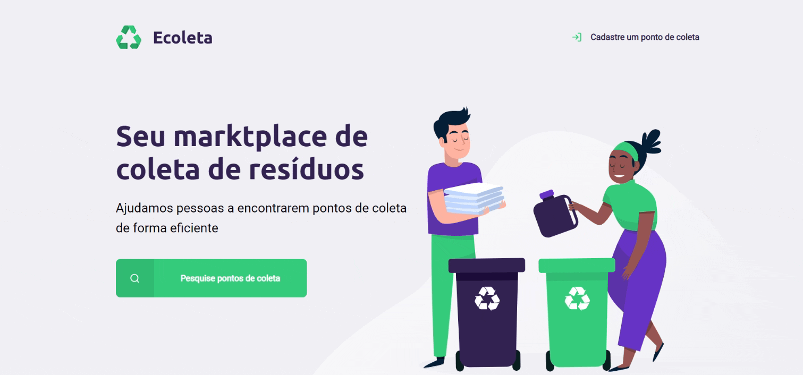

<h1 align="center">
    
</h1>

<h1>
    
</h1>

## 📜 About

The **Ecoleta** project is a solid waste collection marketplace, developed in **[Rocketseat](https://rocketseat.com.br/)'s Next Level Week**.

---

## 🚀 Technologies

The project was developed with the following technologies:

- [Node.js](https://nodejs.org/en/)
- [Express](https://expressjs.com/pt-br/)
- [SQLite](https://www.sqlite.org/index.html)
- [Nunjucks](https://mozilla.github.io/nunjucks/)

---

## 📝 License

This project is under the GLP-3.0 license. See the [LICENSE](LICENSE) file for more details.

---

<h4 align="center">
 Made with 🖤 by <a href="https://www.linkedin.com/in/gustavo-de-barrros-rosa-052b0a112/" target="_blank">Gustavo de Barros</a>